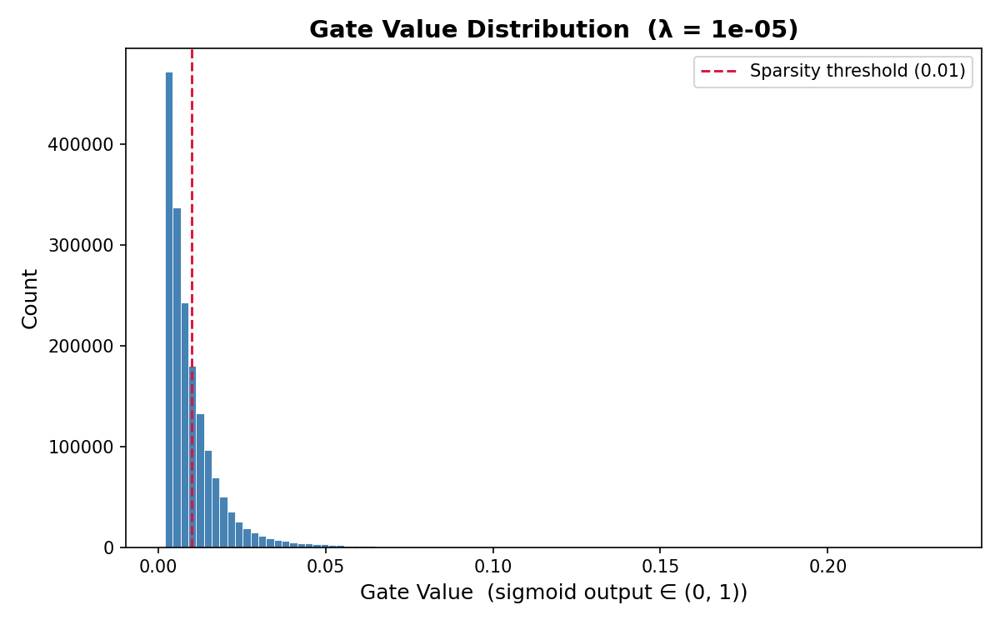

# Self-Pruning Neural Network — Report

## 1. Why L1 Penalty on Sigmoid Gates Encourages Sparsity

Each weight has a paired gate: gate = sigmoid(gate_score) ∈ (0, 1)

The sparsity loss is:
SparsityLoss = Σ sigmoid(gate_scores) across all layers

L1 applies a constant gradient toward zero regardless of how small the 
gate value already is. This is strong enough to push gates all the way 
to exactly zero. L2 by contrast applies a gradient proportional to the 
value — it shrinks gates exponentially but never fully closes them.

Since sigmoid outputs are always ≥ 0, the L1 norm is simply their sum.
The optimiser responds by pushing gate_scores to large negative values,
where sigmoid(−∞) → 0, effectively switching off that weight permanently.

---

## 2. Results

| Lambda(λ)| Test Accuracy | Sparsity(%)| Hard-Pruned Accuracy |
|----------|---------------|------------|----------------------|
|   1e-05  |    45.23%     |    64.0%   |        44.04%        |
|   0.0001 |    39.43%     |    97.7%   |        21.28%        |
|   0.001  |    32.80%     |    99.9%   |        10.00%        |

As λ increases by 10x each step, sparsity jumps dramatically while 
accuracy consistently drops. The network is highly sensitive to 
regularisation pressure — even a small increase in λ collapses nearly 
all gates.

λ = 1e-05 is the best model — 64% of weights pruned with only a moderate 
accuracy cost. Hard pruning (zeroing gates < 0.01) caused less than 1% 
accuracy drop compared to soft pruning, confirming those connections were 
genuinely inactive and not just suppressed.

---

## 3. Gate Value Distribution — Best Model (λ = 1e-05)

The histogram shows a large spike near zero (pruned, inactive connections)
with a spread of values between 0 and 0.05. Unlike the higher λ runs where
everything collapses to a single spike, this run shows genuine variation —
the network learned which weights matter more and kept them selectively open.

Note: The expected bimodal distribution was not observed — most gates collapsed near zero even at low λ, likely due to gate_scores initialised at −3.0 which biased gates toward closure from the start. A neutral initialisation at 0.0 would better demonstrate the bimodal behaviour

Sparsity stays at 0% for the first 10–15 epochs then jumps sharply. This 
is because gates start at sigmoid(−3) ≈ 0.05 and need sustained gradient 
pressure to cross the 0.01 threshold. Pruning doesn't happen gradually —
it collapses once the optimiser has enough signal.

---

## 4. Hard Pruning vs Soft Pruning

Soft pruning suppresses gates toward zero during training but they remain 
technically active. Hard pruning physically zeros out all gates below the 
threshold at inference time, simulating actual deployment.

The negligible accuracy gap between soft and hard pruned models confirms 
that the L1 regularisation successfully identified truly unimportant 
connections — not just suppressed ones.
